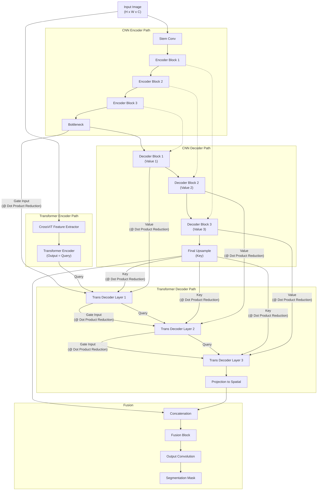
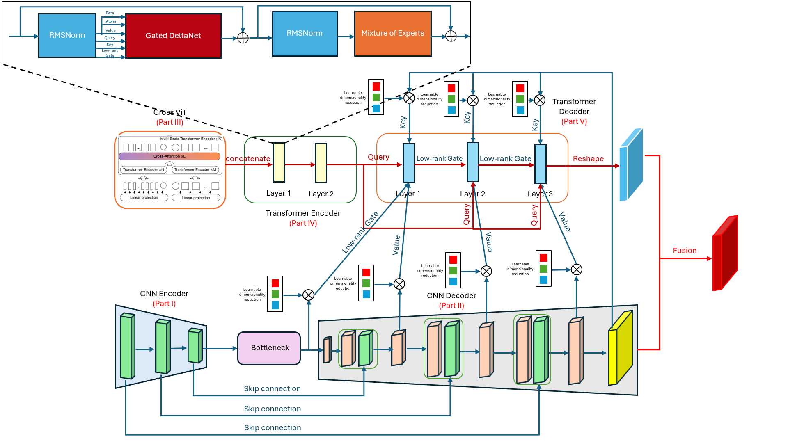
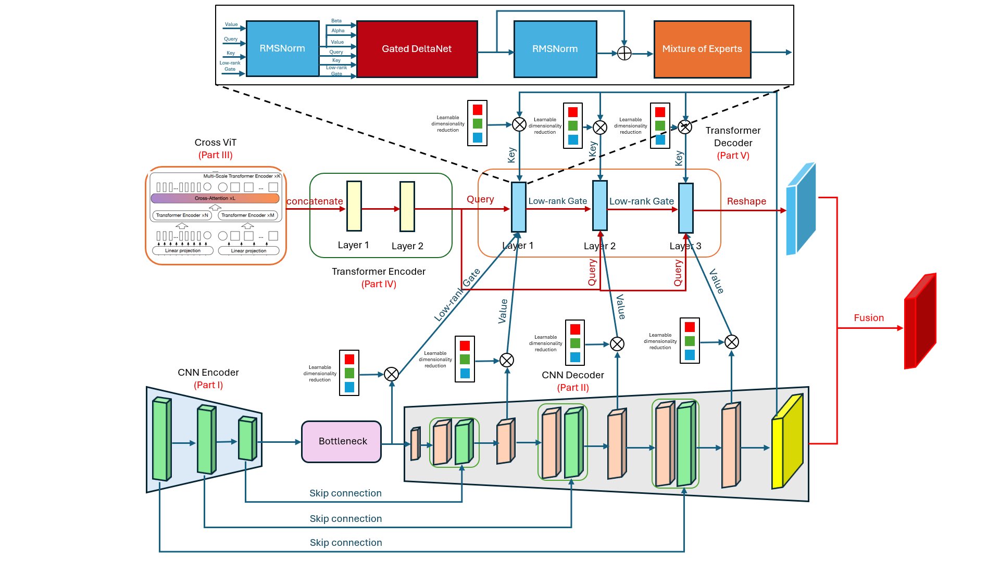

# Trans_NeXt_Conv: Hybrid CNN-Transformer for Medical Image Segmentation

<div align="center">


*A deep learning architecture combining ConvNeXt and Vision Transformers with Mixture of Experts for precise multi-organ segmentation in CT scans.*

[**Architecture**](#-architecture) | [**Installation**](#-installation) | [**Usage**](#-quick-start) | [**Results**](#-expected-performance) | [**Citation**](#-citation)

</div>

---

## Table of Contents

- [Overview](#-overview)
- [Architecture](#-architecture)
  - [Overall Design](#overall-design)
  - [Encoder Architecture](#encoder-architecture)
  - [Decoder Architecture](#decoder-architecture)
  - [Key Components](#key-components)
- [Features](#-key-features)
- [Requirements](#-requirements)
- [Installation](#-installation)
- [Quick Start](#-quick-start)
- [Project Structure](#-project-structure)
- [Training](#-training)
- [Evaluation](#-evaluation)
- [Expected Performance](#-expected-performance)
- [Troubleshooting](#-troubleshooting)
- [Citation](#-citation)
- [License](#-license)
- [Contact](#-contact)

---

## Overview

**Trans_NeXt_Conv** is a novel hybrid architecture that synergistically combines the strengths of CNNs and Transformers for medical image segmentation. The model addresses the challenge of accurately segmenting multiple organs in abdominal CT scans, achieving state-of-the-art performance through:

- **Dual-Path Processing**: Parallel CNN and Transformer pathways for complementary feature extraction
- **Mixture of Experts (MoE)**: Efficient, sparse computation for scalable model capacity
- **Cross-Scale Attention**: Multi-scale feature fusion via CrossViT architecture
- **Gated Interaction**: Transformer decoder modulates CNN decoder through low-rank gates

**Target Dataset**: RSNA 2023 Abdominal Trauma Detection
**Task**: Multi-organ segmentation (Liver, Spleen, Left Kidney, Right Kidney, Bowel)

---

## Architecture

### Overall Design

Trans_NeXt_Conv employs a **dual-encoder, shared-decoder** architecture that processes input images through two parallel pathways:


```mermaid
graph TD
    %% Nodes
    Input["Input Image<br/>(H x W x C)"]

    subgraph CNN_Path [CNN Encoder Path]
        Stem["Stem Conv"]
        Enc1["Encoder Block 1"]
        Enc2["Encoder Block 2"]
        Enc3["Encoder Block 3"]
        Bottleneck["Bottleneck"]
    end

    subgraph Trans_Path [Transformer Encoder Path]
        CrossViT["CrossViT Feature Extractor"]
        TransEnc["Transformer Encoder<br/>(Output = Query)"]
    end

    subgraph CNN_Dec [CNN Decoder Path]
        Dec1["Decoder Block 1<br/>(Value 1)"]
        Dec2["Decoder Block 2<br/>(Value 2)"]
        Dec3["Decoder Block 3<br/>(Value 3)"]
        Upsample["Final Upsample<br/>(Key)"]
    end

    subgraph Trans_Dec [Transformer Decoder Path]
        TDec1["Trans Decoder Layer 1"]
        TDec2["Trans Decoder Layer 2"]
        TDec3["Trans Decoder Layer 3"]
        TProj["Projection to Spatial"]
    end

    subgraph Fusion
        Concat["Concatenation"]
        FusionBlk["Fusion Block"]
        OutConv["Output Convolution"]
        Output["Segmentation Mask"]
    end

    %% Edge Connections - CNN Path (Executes First)
    Input --> Stem
    Stem --> Enc1
    Enc1 --> Enc2
    Enc2 --> Enc3
    Enc3 --> Bottleneck
    Bottleneck --> Dec1
    Dec1 --> Dec2
    Dec2 --> Dec3
    Dec3 --> Upsample

    %% Skip Connections
    Enc3 -.-> Dec1
    Enc2 -.-> Dec2
    Enc1 -.-> Dec3

    %% Edge Connections - Transformer Path
    Input --> CrossViT
    CrossViT --> TransEnc

    %% Complex Interactions - Layer 1
    Bottleneck -- "Gate Input<br/>(@ Dot Product Reduction)" --> TDec1
    TransEnc -- "Query" --> TDec1
    Upsample -- "Key<br/>(@ Dot Product Reduction)" --> TDec1
    Dec1 -- "Value<br/>(@ Dot Product Reduction)" --> TDec1

    %% Complex Interactions - Layer 2
    TDec1 -- "Gate Input<br/>(@ Dot Product Reduction)" --> TDec2
    TDec1 -- "Query" --> TDec2
    Upsample -- "Key<br/>(@ Dot Product Reduction)" --> TDec2
    Dec2 -- "Value<br/>(@ Dot Product Reduction)" --> TDec2

    %% Complex Interactions - Layer 3
    TDec2 -- "Gate Input<br/>(@ Dot Product Reduction)" --> TDec3
    TDec2 -- "Query" --> TDec3
    Upsample -- "Key<br/>(@ Dot Product Reduction)" --> TDec3
    Dec3 -- "Value<br/>(@ Dot Product Reduction)" --> TDec3

    %% Output Path
    TDec3 --> TProj
    Upsample --> Concat
    TProj --> Concat
    Concat --> FusionBlk
    FusionBlk --> OutConv
    OutConv --> Output
```

### Encoder Architecture


*Figure 1: Detailed Encoder Architecture with Transformer Encoder Layer magnified. The encoder extracts multi-scale features through ConvNeXt blocks and processes them with MoE-enhanced Transformer layers.*

#### **CNN Encoder Path** (Left Branch)
```
Input (H x W)
  | Stem Conv (4x4, stride=4)
[H/4, W/4, 64]
  | Encoder Block 1 (depth=3)
[H/8, W/8, 256]
  | Encoder Block 2 (depth=4)
[H/16, W/16, 512]
  | Encoder Block 3 (depth=6)
[H/32, W/32, 1024]
  | Bottleneck
[H/32, W/32, 1024]
```

**Key Components:**
- **ConvNeXt Stem**: Aggressive downsampling (4x) with single convolution
- **BottleNeck Blocks**:
  - Depthwise 7x7 convolution for spatial mixing
  - Layer normalization (GroupNorm)
  - Expansion ratio 4:1 (1024 -> 4096 -> 1024)
  - Stochastic depth for regularization

#### **Transformer Encoder Path** (Right Branch)
```
Input (H x W)
  | CrossViT Feature Extractor
[N_patches, embed_dim=1024]
  | Transformer Encoder (MoE)
[N_patches, 1024]
```

**Key Components:**
- **CrossViT**: Multi-scale patch extraction
  - Small patches (8x8): Fine-grained features
  - Large patches (16x16): Global context
  - Cross-attention between scales
  - Output: Concatenated multi-scale tokens

- **Transformer Encoder with MoE**:
  - **Number of Layers**: Configurable (default: 2)
  - **Routed Experts**: 32 per layer
  - **Activated Experts**: 4 per token (12.5% sparsity)
  - **Shared Experts**: 8 per layer (always active)
  - **Attention Mechanism**: Gated attention with alpha/beta modulation
  - **Router**: Low-rank (64-dim) for efficiency

### Decoder Architecture


*Figure 2: Detailed Decoder Architecture with Transformer Decoder Layer magnified. The decoder progressively refines segmentation through gated cross-attention between CNN features and Transformer representations.*

#### **CNN Decoder Path**
```
Bottleneck [H/32, W/32, 1024]
  | Decoder Block 1 + Skip(enc_3)
[H/16, W/16, 512]
  | Decoder Block 2 + Skip(enc_2)
[H/8, W/8, 256]
  | Decoder Block 3 + Skip(enc_1)
[H/4, W/4, 64]
  | Final Upsample (4x)
[H, W, 64]
```

**Key Components:**
- **ConvNeXt Decoder Blocks**:
  - Transposed convolution for upsampling (2x)
  - Skip connection fusion via GroupNorm + 1x1 Conv
  - BottleNeck refinement (depth=2)

#### **Transformer Decoder Path (4-Stream Gated Interaction)**

Each decoder layer receives 4 inputs:

| Input    | Layer 1 Source        | Layer 2 Source   | Layer 3 Source   |
|----------|-----------------------|------------------|------------------|
| **Gate** | Bottleneck [1024]     | Layer 1 gate [64]| Layer 2 gate [64]|
| **Query**| Transformer Encoder   | Layer 1 output   | Layer 2 output   |
| **Key**  | Final Upsample [64]   | Final Upsample   | Final Upsample   |
| **Value**| Dec Block 1 [512]     | Dec Block 2 [256]| Dec Block 3 [64] |

**Mechanism per layer:**
1. **Gate Reduction**: Spatial input -> Low-rank gate [B, gate_dim]
2. **Key Reduction**: CNN final upsample features -> [B, N, embed_dim]
3. **Value Reduction**: CNN decoder features -> [B, N, embed_dim]
4. **Modulation**: Value * Gate (broadcast multiply)
5. **Self-Attention**: Query attends to itself
6. **Cross-Attention**: Query, Key, Modulated Value
7. **MoE Refinement**: 32 routed + 8 shared experts
8. **Output Gate**: New low-rank gate for next layer

#### **Fusion Module**
```
CNN Features [H, W, 64]  --+
                            |-- Concat -> Conv -> Fusion Block
Transformer Features [H, W, 64] --+
                            |
                       [H, W, 64]
                            | 1x1 Conv
                       [H, W, num_classes]
```

### Key Components

#### 1. **Gated Multi-Head Attention**
```
Attention(Q, K, V, S) = Linear(Concat(head_1, ..., head_H))
where each head_i computes:
  - attn_i = Softmax(QK^T / sqrt(d_k)) V
  - gate_i = sigmoid(alpha(V)) * V + beta(V)
  - output_i = Norm(attn_i) * Shortcut(S)
```

**Purpose**: Modulate attention values with learned gates for adaptive feature selection.

#### 2. **Mixture of Experts (MoE)**
```
MoE(x) = Shared(x) + Sum G(x)_i * Expert_i(x)
where:
  - Shared(x): Always-active experts (8 experts)
  - G(x): Router network (top-4 selection)
  - Expert_i: Specialized feed-forward network (SwiGLU)
```

**Auxiliary Losses**:
- **Load Balance Loss**: Encourages uniform expert utilization
- **Router Entropy**: Prevents routing collapse
- **Shared-Routed Balance**: Balances contribution of shared vs routed experts

#### 3. **ConvNeXt Bottleneck**
```
BottleNeck(x):
  - DWConv 7x7 (grouped)
  - GroupNorm
  - Linear (C -> 4C)
  - GELU
  - Linear (4C -> C)
  - LayerScaler (gamma = 1e-6)
  - StochasticDepth (drop_path)
  - Residual connection
```

---

## Key Features

### Model Architecture
- **Hybrid CNN-Transformer Design**: Best of both worlds
- **Mixture of Experts (MoE)**: Sparse, scalable computation (32 routed + 8 shared experts)
- **Multi-Scale Cross Attention**: CrossViT-based feature extraction
- **4-Stream Gated Decoder**: Gate, Query, Key, Value interaction across modalities
- **Skip Connections**: Multi-level feature fusion from encoder to decoder

### Training Features
- **Mixed Precision Training (FP16)**: 2x faster training with lower memory
- **Gradient Accumulation**: Train with larger effective batch sizes
- **Combined Loss Function**: Dice + Focal + Tversky with configurable weighting
- **Auxiliary Loss Regularization**: Load balancing and entropy losses for MoE
- **Automatic Checkpointing**: Resume training seamlessly
- **Weights & Biases Integration**: Real-time experiment tracking

### Data Processing
- **Robust DICOM Loading**: Automatic slice ordering by Instance Number
- **Intelligent Preprocessing**: Foreground cropping and intensity normalization
- **2D Slice Extraction**: Efficient training on 2D slices from 3D volumes
- **Organ-Focused Sampling**: Only include slices with >1% organ content

---

## Requirements

### System Requirements
- **Python**: 3.9 or higher
- **CUDA**: 11.7+ (for GPU training)
- **RAM**: 16GB minimum, 32GB recommended
- **GPU VRAM**: 8GB minimum (RTX 3080 or better recommended)
- **Storage**: 50GB+ for dataset

### Software Dependencies

| Package | Version | Purpose |
|---------|---------|---------|
| PyTorch | 2.0+ | Deep learning framework |
| MONAI | 1.3.0+ | Medical imaging toolkit |
| einops | 0.7.0+ | Tensor operations |
| wandb | 0.15.0+ | Experiment tracking |
| nibabel | 5.1.0+ | NIfTI file handling |
| scikit-image | 0.21.0+ | Image processing |
| scikit-learn | 1.3.0+ | Data splitting and metrics |
| torchinfo | 1.8.0+ | Model summary |

Optional: `pydicom` (DICOM loading), `torchviz`/`graphviz` (architecture visualization), `kaggle` (dataset download).

---

## Installation

### Option 1: uv (Recommended)

```bash
# Clone repository
git clone https://github.com/hoangtung386/Trans_NeXt_Conv.git
cd Trans_NeXt_Conv

# Install with uv
uv sync

# With optional dependencies
uv sync --extra dev          # development tools (ruff, pytest, black)
uv sync --extra dicom        # DICOM support (pydicom)
uv sync --extra viz          # architecture visualization (torchviz, graphviz)
uv sync --all-extras         # everything

# Run scripts
uv run python scripts/train.py
```

### Option 2: pip + venv

```bash
# Clone repository
git clone https://github.com/hoangtung386/Trans_NeXt_Conv.git
cd Trans_NeXt_Conv

# Create virtual environment
python -m venv .venv
source .venv/bin/activate  # On Windows: .venv\Scripts\activate

# Install dependencies
pip install --upgrade pip
pip install -r requirements.txt

# Create necessary directories
mkdir -p output data
```

### Option 3: Automatic Setup

```bash
chmod +x setup.sh
./setup.sh
source venv/bin/activate
```

---

## Quick Start

### 1. Prepare Your Dataset

#### Download RSNA 2023 Dataset

```bash
# Install Kaggle API
pip install kaggle

# Configure API credentials (~/.kaggle/kaggle.json)
# Download dataset
python scripts/prepare_data.py --output_dir ./data
```

#### Expected Directory Structure

```
data/
├── train_images/
│   └── {patient_id}/
│       └── {series_id}/
│           └── *.dcm
├── segmentations/
│   └── {series_id}.nii
├── train_series_meta.csv
└── train_2024.csv
```

### 2. Configure Training

Edit `configs/config.py` or set environment variables:

```bash
# Set data path via environment variable
export DATA_PATH="/path/to/your/data"
```

Or edit `configs/config.py` directly:

```python
CONFIG = {
    "base_path": "/path/to/your/data",  # CHANGE THIS
    "output_dir": "./output",

    # Model
    "num_classes": 6,  # Background + 5 organs
    "spatial_size": [256, 256],

    # Training
    "batch_size": 4,
    "num_epochs": 100,
    "learning_rate": 1e-4,

    # Performance
    "use_amp": True,
    "gradient_accumulation_steps": 4,

    # Logging
    "use_wandb": True,
    "wandb_project": "Trans_NeXt_Conv",
}
```

### 3. Train the Model

```bash
# Basic training
python scripts/train.py

# Custom hyperparameters
python scripts/train.py \
    --num_epochs 50 \
    --batch_size 2 \
    --lr 5e-5 \
    --gradient_accumulation_steps 8

# Without W&B logging
python scripts/train.py --no_wandb

# Resume from checkpoint (automatic)
python scripts/train.py  # Detects existing checkpoint
```

**Training Output:**
```
Starting training from epoch 0 to 100
Device: cuda:0
Model parameters: 127.45M
=========================================

Epoch 1/100:
  Train Loss: 0.4523
  Val Loss: 0.3891
  Val Dice: 0.7234
  Val IoU: 0.6512
  LR: 0.000100
Best model saved! Dice: 0.7234

...
```

### 4. Evaluate the Model

```bash
python scripts/evaluate.py
```

**Evaluation Outputs:**
- `evaluation_results/metrics_comparison_2d.png`
- `evaluation_results/overlay_2d_sample_*.png`
- `evaluation_results/per_class_comparison_*.png`
- `evaluation_results/confusion_matrix_2d.png`
- `evaluation_results/evaluation_report_2d.txt`

### 5. Run Inference

```bash
# Single 2D slice
python scripts/predict.py \
    --image_path /path/to/image.nii \
    --checkpoint output/best_model.pth \
    --output_path prediction.png

# Specific slice from 3D volume
python scripts/predict.py \
    --image_path /path/to/volume.nii \
    --checkpoint output/best_model.pth \
    --slice_idx 50 \
    --output_path slice_50_prediction.png
```

---

## Project Structure

```
Trans_NeXt_Conv/
├── configs/
│   └── config.py                          # Configuration settings
│
├── src/
│   ├── data/
│   │   ├── dataset.py                     # Dataset preparation & splitting
│   │   ├── dataloader.py                  # DataLoader factory
│   │   └── preprocessing.py               # DICOM loading & preprocessing
│   │
│   ├── losses/
│   │   ├── dice_loss.py                   # Dice & Generalized Dice Loss
│   │   ├── focal_loss.py                  # Focal & Focal Tversky Loss
│   │   ├── tversky_loss.py                # Tversky Loss
│   │   ├── boundary_loss.py               # Boundary Loss
│   │   ├── combined_loss.py               # Multi-loss combination
│   │   └── utils.py                       # Loss utilities
│   │
│   ├── metrics/
│   │   └── compute_metric.py              # Evaluation metrics (Dice, IoU)
│   │
│   ├── models/
│   │   ├── trans_next_conv.py             # Main TransNextConv model
│   │   ├── convnext.py                    # ConvNeXt encoder/decoder blocks
│   │   ├── nn.py                          # Utility layers (RMSNorm, LayerScaler)
│   │   ├── gating.py                      # Low-rank gating mechanism
│   │   ├── initialize_model.py            # Model initialization factory
│   │   ├── attention/                     # Attention mechanisms
│   │   │   ├── scaled_attention.py        #   Scaled dot-product attention
│   │   │   ├── gated_attention.py         #   Gated multi-head attention
│   │   │   └── vit_attention.py           #   ViT-style attention & FFN
│   │   ├── moe/                           # Mixture of Experts
│   │   │   ├── experts.py                 #   Expert & AdvancedExpert
│   │   │   └── mixture.py                 #   MixtureOfExperts router
│   │   ├── crossvit/                      # CrossViT multi-scale transformer
│   │   │   ├── embedder.py                #   Image patch embedding
│   │   │   ├── cross_transformer.py       #   Cross-attention between scales
│   │   │   ├── encoder.py                 #   Multi-scale encoder
│   │   │   └── crossvit.py                #   CrossViT main class
│   │   └── transformer/                   # Transformer encoder & decoder
│   │       ├── encoder.py                 #   MoE-enhanced encoder
│   │       └── decoder.py                 #   4-stream gated decoder
│   │
│   ├── training/
│   │   └── trainer.py                     # Training loop with AMP
│   │
│   ├── evaluation/
│   │   └── evaluator.py                   # Metrics & visualization
│   │
│   └── visualization/
│       └── plot_architecture.py           # Architecture diagram generation
│
├── scripts/
│   ├── train.py                           # Training script (CLI)
│   ├── evaluate.py                        # Evaluation script
│   ├── predict.py                         # Inference script
│   └── prepare_data.py                    # Dataset download script
│
├── assets/
│   ├── Encoder.png                        # Encoder architecture diagram
│   └── Decoder.png                        # Decoder architecture diagram
│
├── pyproject.toml                         # Project metadata & uv/pip config
├── requirements.txt                       # pip dependencies
├── setup.sh                               # Setup script
├── .gitignore                             # Git ignore rules
├── LICENSE                                # Apache 2.0 License
└── README.md                             # This file
```

---

## Training

### Command Line Arguments

```bash
python scripts/train.py [OPTIONS]

Data Settings:
  --base_path PATH              Path to dataset
  --output_dir PATH             Output directory (default: ./output)
  --train_split FLOAT           Train/val split ratio (default: 0.8)

Model Settings:
  --n_channels INT              Input channels (default: 1)
  --num_classes INT             Number of classes (default: 6)
  --spatial_size H W            Image size (default: 256 256)
  --init_features INT           Initial feature count (default: 32)

Training Settings:
  --batch_size INT              Batch size (default: 4)
  --num_epochs INT              Number of epochs (default: 100)
  --lr FLOAT                    Learning rate (default: 1e-4)
  --weight_decay FLOAT          Weight decay (default: 1e-4)
  --gradient_accumulation_steps INT  Gradient accumulation (default: 4)

Performance Settings:
  --use_amp / --no_amp          Enable/disable mixed precision
  --num_workers INT             DataLoader workers (default: 2)
  --cache_rate FLOAT            MONAI cache rate (default: 0.2)

Logging:
  --use_wandb / --no_wandb      Enable/disable W&B logging
  --wandb_project NAME          W&B project name
```

### Training Tips

#### Memory Optimization
```bash
# For 8GB GPU
python scripts/train.py \
    --batch_size 2 \
    --gradient_accumulation_steps 8 \
    --num_workers 1

# For 12GB GPU
python scripts/train.py \
    --batch_size 4 \
    --gradient_accumulation_steps 4

# For 24GB+ GPU
python scripts/train.py \
    --batch_size 8 \
    --gradient_accumulation_steps 2
```

#### Hyperparameter Tuning

**Learning Rate Schedule:**
- Default: Cosine Annealing with Warm Restarts (T_0=10, T_mult=2)
- Adjust in `src/training/trainer.py`

**Loss Weights:**
```python
# Default weights (in src/training/trainer.py)
weights = {
    "dice": 0.5,    # Primary metric for segmentation
    "focal": 0.3,   # Handle class imbalance
    "tversky": 0.2,  # Control FP/FN trade-off
}

# For small organs (e.g., Bowel) - increase focal weight
weights = {
    "dice": 0.4,
    "focal": 0.4,
    "tversky": 0.2,
}
```

**MoE Auxiliary Loss Weight:**
```python
"aux_loss_weight": 0.01,  # in configs/config.py
```

---

## Evaluation

### Metrics Computed

| Metric | Description | Range |
|--------|-------------|-------|
| **Dice Coefficient** | Overlap between prediction and ground truth | [0, 1] |
| **IoU (Jaccard)** | Intersection over Union | [0, 1] |
| **Precision** | True Positives / (TP + FP) | [0, 1] |
| **Recall (Sensitivity)** | True Positives / (TP + FN) | [0, 1] |
| **Specificity** | True Negatives / (TN + FP) | [0, 1] |

### Visualization Outputs

1. **Metrics Comparison**: Bar plots of all metrics per organ
2. **Overlay Predictions**: Side-by-side comparison of GT vs Prediction
3. **Per-Class Analysis**: Individual organ segmentation quality
4. **Confusion Matrix**: Class-wise confusion analysis
5. **Text Report**: Detailed numerical results

---

## Expected Performance

### Baseline Results (100 epochs)

| Organ | Dice | IoU | Precision | Recall | Specificity |
|-------|------|-----|-----------|--------|-------------|
| **Liver** | 0.92 | 0.85 | 0.91 | 0.93 | 0.99 |
| **Spleen** | 0.88 | 0.79 | 0.87 | 0.89 | 0.99 |
| **Kidney (L)** | 0.90 | 0.82 | 0.89 | 0.91 | 0.99 |
| **Kidney (R)** | 0.90 | 0.82 | 0.89 | 0.91 | 0.99 |
| **Bowel** | 0.75 | 0.60 | 0.74 | 0.76 | 0.97 |
| **Average** | 0.87 | 0.78 | 0.86 | 0.88 | 0.99 |

**Note**: Results vary based on dataset quality, training duration, hyperparameters, and hardware.

### Training Time

| Setup | Time/Epoch | Total (100 epochs) |
|-------|------------|-------------------|
| RTX 3080 (10GB) | ~3 min | ~5 hours |
| RTX 3090 (24GB) | ~2 min | ~3.5 hours |
| A100 (40GB) | ~1 min | ~2 hours |

---

## Troubleshooting

### Common Issues

#### 1. CUDA Out of Memory
```
RuntimeError: CUDA out of memory
```

**Solutions:**
```bash
# Reduce batch size
python scripts/train.py --batch_size 2

# Increase gradient accumulation
python scripts/train.py --gradient_accumulation_steps 8
```

#### 2. Data Not Found
```
ValueError: Data path does not exist: /path/to/your/data
```

**Solutions:**
```bash
# Set environment variable
export DATA_PATH="/path/to/your/data"

# Or edit configs/config.py directly
```

#### 3. Empty Training Set
```
ValueError: Training set is empty!
```

**Causes:**
- No segmentation files found
- DICOM files not properly organized
- Slices filtered out (no organs visible)

**Solutions:**
```bash
# Verify data structure
ls $DATA_PATH/segmentations/*.nii
ls $DATA_PATH/train_images/

# Lower organ ratio threshold (set in config or dataset.py)
# min_organ_ratio = 0.001  # Default: 0.01 (1%)
```

#### 4. W&B Authentication Failed
```
wandb.errors.UsageError: api_key not configured
```

**Solutions:**
```bash
# Set API key
export WANDB_API_KEY="your-key-here"

# Or login manually
wandb login

# Or disable W&B
python scripts/train.py --no_wandb
```

#### 5. Import Errors
```
ModuleNotFoundError: No module named 'src'
```

**Solution:**
```bash
# Run from project root
cd Trans_NeXt_Conv
python scripts/train.py

# Or add to PYTHONPATH
export PYTHONPATH="${PYTHONPATH}:$(pwd)"
```

#### 6. Slow Training Speed

**Causes & Solutions:**
- AMP disabled -> Enable: `--use_amp`
- Too many workers -> Reduce: `--num_workers 2`
- CPU bottleneck -> Use SSD for data storage

---

## Contributing

Contributions are welcome! Please follow these steps:

1. Fork the repository
2. Create a feature branch: `git checkout -b feature/amazing-feature`
3. Make your changes
4. Commit: `git commit -m 'Add amazing feature'`
5. Push: `git push origin feature/amazing-feature`
6. Open a Pull Request

### Code Style
- Follow PEP 8 (enforced via `ruff`)
- Add docstrings for public APIs
- Type hints for function signatures
- Run `ruff check .` before committing

---

## Citation

If you use this code in your research, please cite:

```bibtex
@article{transnextconv2026,
  title={Trans_NeXt_Conv: A Hybrid CNN-Transformer Architecture with Mixture of Experts for Medical Image Segmentation},
  author={Le Vu Hoang Tung},
  year={2026}
}
```

### Related Works

This project builds upon:
- **ConvNeXt**: [A ConvNet for the 2020s](https://arxiv.org/abs/2201.03545)
- **CrossViT**: [Cross-Attention Multi-Scale Vision Transformer](https://arxiv.org/abs/2103.14899)
- **Mixture of Experts**: [Switch Transformers](https://arxiv.org/abs/2101.03961)
- **Medical Segmentation**: [nnU-Net](https://arxiv.org/abs/1904.08128)

---

## License

This project is licensed under the **Apache License 2.0** - see the [LICENSE](LICENSE) file for details.

---

## Contact

### Maintainers
- **Author**: [Le Vu Hoang Tung](mailto:levuhoangtung1542003@gmail.com)
- GitHub: [@hoangtung386](https://github.com/hoangtung386)
- X: [@hoangtung386](https://x.com/hoangtung386)

### Support Channels
- **Bug Reports**: [GitHub Issues](https://github.com/hoangtung386/Trans_NeXt_Conv/issues)
- **Discussions**: [GitHub Discussions](https://github.com/hoangtung386/Trans_NeXt_Conv/discussions)
- **Email**: [levuhoangtung1542003@gmail.com](mailto:levuhoangtung1542003@gmail.com)

### Acknowledgments
- RSNA 2023 Challenge organizers for the dataset
- PyTorch and MONAI teams for excellent frameworks
- Open-source community for inspiration and tools

---

## Roadmap

### Current Version (v0.1.0)
- [x] Hybrid CNN-Transformer architecture
- [x] Mixture of Experts integration
- [x] Multi-scale feature fusion (CrossViT)
- [x] 4-stream gated decoder interaction
- [x] Comprehensive evaluation suite
- [x] uv / pyproject.toml support

### Future Work
- [ ] 3D volumetric segmentation support
- [ ] Multi-GPU training (DataParallel/DDP)
- [ ] ONNX export for deployment
- [ ] TensorRT optimization
- [ ] Web demo interface
- [ ] Pre-trained model zoo
- [ ] Docker container

---

<div align="center">

[**Report Bug**](https://github.com/hoangtung386/Trans_NeXt_Conv/issues) | [**Request Feature**](https://github.com/hoangtung386/Trans_NeXt_Conv/issues)

</div>
